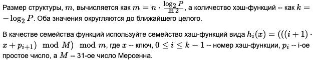

# Практические задания по курсу Алгоритмов и структур данных

## МГТУ им. Баумана, кафедра ИУ8, 2024 год

### Модуль 1:

#### - A - [Бинарный поиск](module1/taskA.py)

  - Реализуйте рекурсивно алгоритм бинарного поиска. Реализация алгоритма должна быть инкапуслирована, т.е. не зависеть от форматов входных/выходных данных и непосредственно ввода/вывода.
  - **Формат ввода**
    - Ввод осуществляется со стандартного потока ввода. Первая строка всегда содержит отсортированный массив, в котором должен производится поиск. Остальные строки имеют формат search K, где K - некоторое число.
  - **Формат вывода**
    - Результат поиска - первый индекс числа в массиве. Если число в массиве отсутствует, то результатом будет -1. Результат работы программы выводится в стандартный поток вывода.

#### - B - [Двунаправленная очередь](module1/taskB.py)

  - Реализуйте дек (двунаправленную очередь), используя только массив.
  - **Формат ввода**
    - На стандартном потоке ввода задаётся последовательность команд. Пустые строки игнорируются. Первая строка всегда содержит "set_size N", где N - максимальный размер дека, целое число. Каждая последующая строка содержит ровно одну команду: pushf X, pushb X, popf, popb или print, где X - произвольная строка без пробелов.
  - **Формат вывода**
    - Результат работы программы выводится в стандартный поток вывода и зависит от команды.
      - Команда print выводит содержимое дека одной строкой, значения разделяются пробелами. Если дек пуст, то выводится "empty".
      - Команда pushb добавляет элемент в конец дека.
      - Команда pushf добавляет элемент в начало дека.
      - Команда popf извлекает и выводит первый элемент или "underflow", если дек пуст.
      - Команда popb извлекает и выводит последний элемент или "underflow", если дек пуст.
    - В любой непонятной ситуации результатом работы любой команды будет "error".

#### - C - [Обход графа](module1/taskC.py)

  - Реализуйте обход графа в ширину и глубину.
  - **Формат ввода**
    - Первая строка стандартного потока ввода данных имеет формат "graph_type start_vertex search_type", где
      - "graph_type" - тип графа, ориентированный ('d') или неориентированный ('u');
      - "start_vertex" - идентификатор вершины, с которой начинать обход графа;
      - "search_type" - тип обхода, в ширину ('b') или в глубину ('d').
    - Каждая последующая строка содержит ребро, которая представляет собой идентификаторы начальной и конечной вершины, разделенные пробелом.
  - **Формат вывода**
    - Результат работы программы выводится в стандартный поток вывода. Идентификаторы посещенных вершин выводятся по одному в строке в порядке обхода.

### Модуль 2:

#### - A - [Двоичное дерево поиска](module2/taskA.py)

  - Реализуйте двоичное дерево поиска. Реализация самой структуры данных должна быть инкапуслирована, т.е. не зависеть от форматов входных/выходных данных и непосредственно ввода/вывода.
  - Тесты предполагают левостороннюю реализацию, т.е. если действие можно реализовать двумя симметричными способами, надо делать тот, который больше использует левую сторону.
  - **Формат ввода**
    - На стандартном потоке ввода задаётся последовательность команд. Пустые строки игнорируются. Каждая строка содержит ровно одну команду: add K V, set K V, delete K, search K, min, max или print, где K - целое число (64 бита вам хватит), ключ, V - произвольная строка без пробелов (значение).
      Команда add добавляет значение V в дерево по ключу K;
      - Команда set изменяет значение по ключу K на V;
      - Команда delete удаляет вершину с ключом K;
      - Команда search ищет значение по ключу K;
      - Команды min и max находят ключ и значение вершины, с наименьшим/наибольшим ключом;
      - Команда print выводит все дерево целиком.
  - **Формат вывода**
    - Результат работы программы выводится в стандартный поток вывода и зависит от команды.
      - Команда search выводит либо "1 V", либо "0", где V - значение для найденного ключа;
      - Команды min и max выводят "K V", где K - минимальный или максимальный ключ дерева соответственно, V - значение по этому ключу;
      - При вызове команды print дерево выводится строго по уровням, слева направо, 1 строка - 1 уровень. Первая строка содержит только корень дерева в формате "[K V]" или " _ ", если дерево пустое. Каждая последующая строка содержит один уровень дерева. Вершины выводятся в формате "[K V P]", где P - ключ родительской вершины. Если вершина отсутствует, ставится "_". Вершины разделены пробелом.
    - В любой непонятной ситуации результатом работы любой команды будет "error".

#### - B - [Косое дерево](module2/taskB.py)

  - Реализуйте косое дерево. Реализация самой структуры данных должна быть инкапуслирована, т.е. не зависеть от форматов входных/выходных данных и непосредственно ввода/вывода.
  - Тесты предполагают левостороннюю реализацию, т.е. если действие можно реализовать двумя симметричными способами, надо делать тот, который больше использует левую сторону.
  - **Формат ввода**
    - На стандартном потоке ввода задаётся последовательность команд. Пустые строки игнорируются. Каждая строка содержит ровно одну команду: add K V, set K V, delete K, search K, min, max или print, где K - целое число (64 бита вам хватит), ключ, V - произвольная строка без пробелов (значение).
      Команда add добавляет значение V в дерево по ключу K;
      - Команда set изменяет значение по ключу K на V;
      - Команда delete удаляет вершину с ключом K;
      - Команда search ищет значение по ключу K;
      - Команды min и max находят ключ и значение вершины, с наименьшим/наибольшим ключом;
      - Команда print выводит все дерево целиком.
  - **Формат вывода**
      - Результат работы программы выводится в стандартный поток вывода и зависит от команды.
        - Команда search выводит либо "1 V", либо "0", где V - значение для найденного ключа;
        - Команды min и max выводят "K V", где K - минимальный или максимальный ключ дерева соответственно, V - значение по этому ключу;
        - При вызове команды print дерево выводится строго по уровням, слева направо, 1 строка - 1 уровень. Первая строка содержит только корень дерева в формате "[K V]" или " _ ", если дерево пустое. Каждая последующая строка содержит один уровень дерева. Вершины выводятся в формате "[K V P]", где P - ключ родительской вершины. Если вершина отсутствует, ставится "_". Вершины разделены пробелом.
      - В любой непонятной ситуации результатом работы любой команды будет "error".

#### - C - [Двоичная min-куча](module2/taskC.py)

  - Реализуйте двоичную min-кучу. Модифицируйте ее таким образом, чтобы внутреннее ее строение было таким же, но при этом доступ по ключу к любому элементу осуществлялся в среднем за константное время. Реализация самой структуры данных должна быть инкапуслирована, т.е. не зависеть от форматов входных/выходных данных и непосредственно ввода/вывода.
  - **Формат ввода**
    - На стандартном потоке ввода задаётся последовательность команд. Пустые строки игнорируются. Каждая строка содержит ровно одну команду: add K V, set K V, delete K, search K, min, max, extract или print, где K - целое число (64 бита вам хватит), ключ, V - произвольная строка без пробелов (значение).
      - Команда add добавляет значение V в кучу по ключу K;
      - Команда set изменяет значение по ключу K на V;
      - Команда delete удаляет вершину с ключом K;
      - Команда search ищет значение и индекс по ключу K;
      - Команда extract извлекает корень кучи;
      - Команды min и max находят ключ, значение и индекс вершины, с наименьшим/наибольшим ключом;
      - Команда print выводит всю кучу целиком.
  - **Формат вывода**
  - Результат работы программы выводится в стандартный поток вывода и зависит от команды.
    - Команда search выводит либо "1 I V", либо "0", где I - индекс, V - значение для найденного ключа;
    - Команды min и max выводят "K I V", где K - минимальный или максимальный ключ кучи соответственно, I - индекс, V - значение по этому ключу; *Команда extract извлекает корень кучи и выводит "K V", где K, V - ключ и значение извлеченного элемента;
    - При вызове команды print куча выводится строго по уровням, слева направо, 1 строка - 1 уровень. Первая строка содержит только корень дерева в формате "[K V]" или "_", если дерево пустое. Каждая последующая строка содержит один уровень дерева. Вершины выводятся в формате "[K V P]", где P - ключ родительской вершины. Если вершина отсутствует, ставится "_". Вершины разделены пробелом.
  - В любой непонятной ситуации результатом работы любой команды будет "error".

### Модуль 3:

#### - A - [Блокировка логина](module3/taskA.py)

  - Реализуйте алгоритм, который на основе истории неуспешных попыток логина пользователя в систему блокирует ему доступ. Пользователь блокируется на некоторый период времени
B в случае нескольких неуспешных попыток входа
N в течение определенного интервала времени 
P.
  - Блокировка начинается сразу после последней неудачной попытки логина. В случае, если пользователь уже был недавно заблокирован, то время повторной блокировки удваивается за каждую блокировку, т.е. растет экспоненциально. При этом время блокировки ограничено сверху некоторым периодом
Bmax. При расчете учитываются все попытки за период
2⋅Bmax.
  - В примере ниже если пользователь совершит 5 неуспешных попыток в течение часа, то он должен быть заблокирован на 2 часа. Если после окончания блока он еще раз не сможет залогиниться за 5 попыток в течение часа, то он будет заблокирован уже на 4 часа, потом на 8 и т.д., но не более чем на 30 дней.
  - **Формат ввода**
    - В первой строке стандартного потока записаны через пробел параметры задачи: количество попыток
N, интервал
P в секундах, начальное время блокировки
B в секундах, максимальное время блокировки
Bmax
  в секундах и текущее Unix-время.
Каждая последующая строка содержит Unix-время неудачной попытки логина пользователя.
Все параметры и времена — целые неотрицательные числа.
  - **Формат вывода**
    - Вывод должен содержать Unix-время окончания блокировки пользователя или ok, если пользователя не надо блокировать или время его блокировки истекло. Результат работы программы выводится в стандартный поток вывода.

#### - B - [Фильтр Блума](module3/taskB.py)

  - Реализуйте фильтр Блума, позволяющий дать быстрый, но вероятностный ответ, присутствует ли объект в коллекции.Реализация самой структуры данных должна быть инкапуслирована, т.е. не зависеть от форматов входных/выходных данных и непосредственно ввода/вывода.
Реализация битового массива также должна быть инкапсулирована. Массив битов должен быть эффективно расположен в памяти. Параметрами структуры данных являются
n - приблизительное количество элементов (целое),
P - вероятность ложноположительного ответа.
  - 
  - **Формат ввода**
    - На стандартном потоке ввода задаётся последовательность команд. Пустые строки игнорируются.
    - Первая строка содержит команду вида set n P. Каждая последующая строка содержит ровно одну команду: add K, search K или print, где K - неотрицательное число (64 бита вам хватит), ключ.
      - Команда set инициализирует структуру и выводит вычисленные параметры в формате "m k";
      - Команда add добавляет в структуру ключ K;
      - Команда search выводит либо "1", если элемент возможно присутствует в структуре, либо "0", если он там отсутствует;
      - Команда print выводит внутреннее состояние структуры - последовательность из 0 и 1, не разделенную пробелами.
  - **Формат вывода**
    - Результат работы программы выводится в стандартный поток вывода. В любой непонятной ситуации результатом работы любой команды будет "error".

#### - C - [Приближенный рюкзак](module3/taskC.py)

  - Решите задачу о рюкзаке приближенно. Алгоритм должен быть инкапсулирован.
  - **Формат ввода**
    - Данные подаются на стандартный поток ввода. Пустые строки игнорируются.
      - Первая строка содержит дробное число от 0 до 1 — коэффициент приближения. 0 — решение должно совпасть с оптимальным, 0.1 — отличается не более чем на 10% и т.д.
      - Вторая строка содержит целое неотрицательное число — максимальную массу предметов, которую выдержит рюкзак.
      - Каждая последующая содержит два целых неотрицательных числа: массу предмета и его стоимость.
  - **Формат вывода**
    - Результат работы программы выводится в стандартный поток вывода.
    - Первая строка содержит два числа: суммарную массу предметов и их суммарную стоимость.
    - В последующих строках записаны номера предметов, которые были помещены в рюкзак, в порядке возрастания.